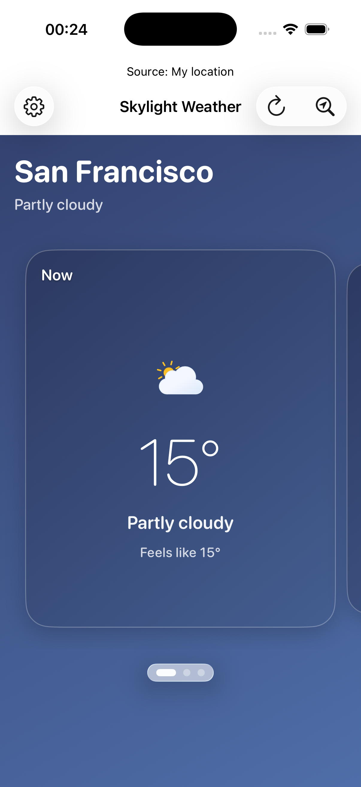
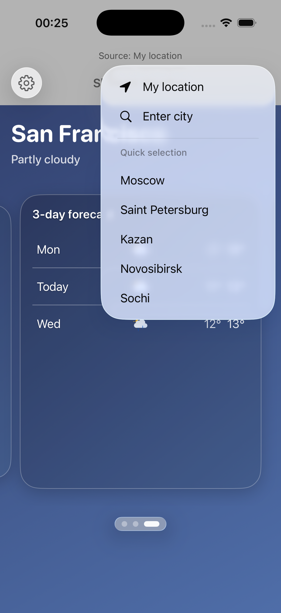

# Skylight Weather

iOS weather app (UIKit + SwiftUI) implemented fully programmatically (no Storyboards).

## Screenshots

| Light | Dark |
|---|---|
|  |  |

## Features

- Current weather for selected source (current location or city)
- Hourly forecast: remaining hours of today + all hours of tomorrow
- Daily forecast: up to 7 days
- Loading/error states with retry
- Invalid city handling with user-friendly warning
- Location permission request on start with Moscow fallback when denied/unavailable
- City search with suggestions (`MKLocalSearchCompleter`)
- Settings: theme, language, widget hint
- Home Screen widget (small/medium)
- Localization (`en`, `ru`)

## Architecture

Layered structure:

- `Presentation` (UIKit container + SwiftUI views, ViewModel, city search, settings)
- `Domain` (ViewData models, use case)
- `Data` (network client, DTOs, mappers, location, preferences)
- `Core` (localization, logging, runtime config, haptics)
- `SkylightWeatherShared` (App Group shared models/keys for widget)

Patterns and technologies:

- MVVM
- `@Observable`
- Swift Concurrency (`async/await`, `Task`, `async let`)
- `URLSession`
- `OSLog`

## Tech Stack

| Layer | Stack |
|-------|-------|
| UI | SwiftUI, UIKit, Lottie |
| State | `@Observable`, MVVM |
| Concurrency | Swift 6, async/await |
| Data | URLSession, WeatherAPI |
| Location | CoreLocation, MapKit (city suggestions) |
| Widget | WidgetKit |
| Storage | UserDefaults + App Group |

## Requirements

- iOS 17+
- Xcode (latest stable recommended)
- WeatherAPI key (set in Build Settings as `WEATHER_API_KEY`)

## Environment Configuration

`SkylightWeather` target uses build configurations as environments:

- `Debug` -> `dev`
- `Release` -> `prod`

Runtime values are injected through `Info.plist`:

- `APP_ENVIRONMENT`
- `WEATHER_API_SCHEME`
- `WEATHER_API_HOST`
- `WEATHER_API_KEY`

Where to configure:

1. Open target `SkylightWeather`
2. Go to `Build Settings`
3. Set `WEATHER_API_*` for `Debug` / `Release`

Local secrets setup (recommended):

1. `Secrets.xcconfig.example` is committed and used as base config (safe default: empty key).
2. `Secrets.xcconfig` is local-only (gitignored) and contains your real `WEATHER_API_KEY`.
3. If `Secrets.xcconfig` exists, its values override the example file via optional include.

Security note:
- API keys in mobile clients are extractable.
- Production-grade security requires storing third-party credentials encrypted on backend/proxy and calling backend from the app.

## Build & Run

```bash
open SkylightWeather.xcodeproj
```

In Xcode:

1. Select scheme `SkylightWeather`
2. Choose configuration (`Debug` or `Release`)
3. Run on iOS Simulator or device

Widget:

1. Install and run app once
2. Long press Home Screen
3. Tap `+`
4. Find `Skylight Weather`
5. Add widget

## Tests

Run tests:

```bash
xcodebuild -project SkylightWeather.xcodeproj -scheme SkylightWeather -destination 'platform=iOS Simulator,name=iPhone 17,OS=26.2' test
```

UI tests included:

- `testSettingsSheetOpenAndClose`
- `testHourlyInnerScrollDoesNotSwitchPagerCard`

Manual scenarios (recommended):

1. Card gesture arbitration
   Open the app, swipe to the hourly card, then swipe left/right inside the hourly strip.
   Expected: inner hourly strip scrolls independently and outer page stays on the hourly card.
2. City search and invalid city handling
   Open source menu -> `Enter city`, type a valid city and apply.
   Then enter an invalid city string (for example `Sfgfg`) and confirm.
   Expected: localized invalid city warning with `OK`; after `OK` app returns to the previous valid source.

## Permissions

- `NSLocationWhenInUseUsageDescription` is required to fetch weather by current location.

If denied/restricted, app automatically falls back to Moscow coordinates.
